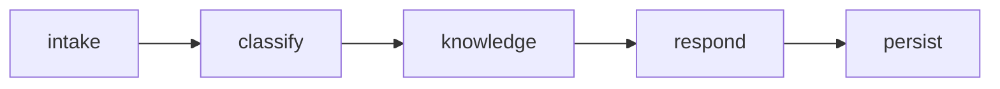

# Customer Support Assistant

Independent customer-support triage application powered by `orbit-core`. Its
native workflow validates a ticket, classifies it, retrieves versioned support
knowledge, composes a recommended response, and persists the result behind an
application-owned repository boundary.



Production composition uses the application-owned PostgreSQL repository.
Deterministic tests inject an in-memory or SQLite-backed repository. Live LLM
response composition is configuration-controlled: classification, approved
knowledge retrieval, citations, and persistence stay deterministic while only
the customer-facing response text is generated by the model. Langfuse and
Admin telemetry use Orbit Core's existing observability contracts.

## Local verification

Copy `.env.example` to `.env` for live execution. Set
`LIVE_LLM_ENABLED=true`, configure the Azure OpenAI endpoint, API key,
deployment, API version, and temperature, and configure this use case's own
Langfuse public key, secret key, base URL, and project URL. Never commit `.env`
or credentials, and do not reuse another use case's Langfuse project keys.
Leave `LIVE_LLM_ENABLED=false` for deterministic execution.
`LANGFUSE_CAPTURE_LLM_IO` defaults to `false`; enable it only when complete
prompts and responses are approved for the dedicated project's access and
retention policy.

The example also defines bounded node and LLM retries, exponential backoff, a
whole-workflow timeout, per-process workflow concurrency, LLM rate limiting,
and SQLAlchemy pool controls. Attempt counts include the initial call, and all
limits are per process/pod rather than distributed across replicas.

## Install with private GitHub source

For local development, install the pinned core release and then this repo:

```powershell
python -m pip install `
  "orbit-core @ git+https://github.com/nagaraju-ssa/orbit-repo.git@v0.1.0"
python -m pip install -e ".[test]"
```

Git authentication must come from the developer's credential manager or an
approved environment variable. Do not place a token in `pyproject.toml`, a
requirements file, or a committed URL.

## Install with Azure Artifacts

Authenticate with the team's approved Azure Artifacts credential provider,
then supply the feed as an extra index:

```powershell
$env:PIP_EXTRA_INDEX_URL = "https://pkgs.dev.azure.com/orbit-ai-platform/orbit-repo/_packaging/orbit-core/pypi/simple/"
python -m pip install -e ".[test]"
```

The declared `orbit-core==0.1.0` dependency is then resolved from the private
feed in the `orbit-ai-platform` Azure DevOps organization.

## Run and test the workflow

```powershell
python -m pytest
python -m customer_support_assistant.cli --task "Unable to access monthly statement"
uvicorn customer_support_assistant.api:create_app --factory --reload
```

### Local demo endpoints

- Workflow Dashboard: `http://127.0.0.1:8030/ui/`
- User Guide: `http://127.0.0.1:8030/ui/guide.html`
- Repository documentation: `http://127.0.0.1:8030/documentation/readme`
- Operational handoff: `http://127.0.0.1:8030/documentation/handoff`
- Swagger UI: `http://127.0.0.1:8030/docs`
- Readiness: `http://127.0.0.1:8030/health/ready`
- Admin Dashboard: `http://127.0.0.1:8010/admin/`
- Workflow: `POST /support/triage`
- Stored case: `GET /cases/{case_id}`
- Run history: `GET /api/cases?page=1&page_size=10&search=...`
- Workflow trends: `GET /api/cases/trends?days=14`

The workflow dashboard supports form-based execution, PostgreSQL-backed
history, search, pagination, detailed input/output review, 14-day trends,
compact priority and classification charts, dark/light themes, Swagger access,
Langfuse navigation, and a separate client-demo guide. The User Guide now
documents the business problem, Orbit solution, business value, intended
users, inputs/outputs, integrations, human controls, and demo narrative. The Admin
Dashboard's **Run Workflow** action opens this UI in a new tab. Admin receives
sanitized workflow telemetry; ticket content, knowledge payloads, and
recommended responses remain owned by this use case.

The dashboard generates a read-only ticket ID in the form `CS-XXXXXXXX`, where
the suffix is eight uppercase alphanumeric characters. A fresh ID is prepared
after every successful run. API callers may omit `ticket_id`; the server then
generates the same format. Existing callers can still supply their own non-empty
identifier for backward compatibility.

The approved deterministic API contract is:

- `GET /health/`
- `GET /health/ready`
- `POST /support/triage`
- `GET /cases/{case_id}`
- `GET /api/cases`
- `GET /api/cases/trends`
- `GET /api/ui-config`
- `GET /openapi.json`

Example request:

```json
{
  "subject": "Unable to access monthly statement",
  "message": "My July statement does not appear after I sign in.",
  "customer_tier": "gold",
  "user_id": "demo-presenter",
  "conversation_id": "demo-support-1001"
}
```

The response contains the generated ticket ID, case ID, classification,
priority, approved knowledge
citations, recommended response, workflow/request identifiers, and creation
time. It does not expose prompts or internal tool payloads.

When live mode is enabled, one LLM call composes `recommended_response` from
the already classified ticket and approved knowledge result. Orbit Core
captures provider token usage, preserves provider-reported cost when available,
and otherwise produces a versioned Azure OpenAI estimate when the platform
pricing variables are configured. It correlates the Langfuse trace with the
Admin workflow run.

## Build the demo image

Build Orbit Core first as `orbit-core:demo-205aab8`, then build this
application layer:

```powershell
docker build `
  --build-arg ORBIT_CORE_IMAGE=orbit-core:demo-205aab8 `
  --tag customer-support-assistant:demo-0.1.0 `
  .
```

The image runs as the non-root `orbit` user. `.env`, local virtual
environments, tests, logs, and Git metadata are excluded from the build
context. Inject `DATABASE_URL` only when the container starts.

Admin registration, heartbeat, and sanitized workflow telemetry are optional
and fail open. Enable them at deployment time with the
`ORBIT_ADMIN_CLIENT_*` settings documented in `.env.example`; do not bake
Admin URLs or credentials into the image.

## Azure DEV

Azure DEV runs immutable commit-tagged images in AKS behind Microsoft Entra
perimeter SSO:

- Workflow Dashboard:
  `https://support.20.235.211.237.sslip.io/ui/`
- User Guide: `https://support.20.235.211.237.sslip.io/ui/guide.html`
- Repository documentation: `https://support.20.235.211.237.sslip.io/documentation/readme`
- Operational handoff: `https://support.20.235.211.237.sslip.io/documentation/handoff`

The Markdown files in this repository are authoritative. The API renders only
the allowlisted `README.md` and `HANDOFF.md` files at the routes above; Admin
stores their URLs and never copies their content into PostgreSQL. Publish a
documentation change through the normal tested image rebuild and deployment.
No business-data migration or document synchronization step is required.
- Swagger: `https://support.20.235.211.237.sslip.io/docs`

The deployment has one economical DEV replica, reads secrets through the
platform Key Vault/CSI configuration, persists business records in the
`customer_support` PostgreSQL database, and publishes sanitized telemetry to
Admin. Promote by commit SHA and ACR image tag; do not deploy mutable tags.

```json
{"task": "Review customer C-100"}
```

After initialization, use the renamed package in the CLI and Uvicorn commands.

## CI configuration

The workflow defaults to the private GitHub source. Add this repository secret:

- `ORBIT_CORE_GITHUB_TOKEN`: read-only fine-grained token for the private
  `nagaraju-ssa/orbit-repo` repository.

Optional repository variables and secrets:

- `ORBIT_CORE_REF`: approved immutable core tag or commit; the workflow
  defaults to the verified local-demo stability commit
  `ab6504b389240aa95b7de1d691a081cd06e9d2f4`.
- `ORBIT_CORE_SOURCE=azure`: resolve the core package from Azure Artifacts.
- `ORBIT_PYPI_INDEX_URL`: authenticated Azure Artifacts Python index URL.

## What teams replace

- `tools.py`: injected clients for approved external systems;
- `agents.py`: one focused capability per agent;
- `workflow.yaml`: orchestration and execution adapter;
- `config.py` and `.env.example`: typed non-secret configuration names;
- tests: deterministic unit, workflow, API, and integration coverage.

Keep business models and calculations outside agents where possible. Add live
systems one boundary at a time, and preserve the public Orbit Core contracts.

The complete training path, checklist, architecture guidance, security rules,
and production-readiness criteria are maintained in the Orbit Core repository
under `docs/usecase-development/`.

For implementation ownership, Orbit Core integration details, configuration,
local and Azure operations, observability, rollback, and transfer checks, see
[HANDOFF.md](HANDOFF.md).

## Governed model routing

Live response composition uses Orbit Core's provider-neutral model gateway.
Azure OpenAI `gpt-5.4-mini` is primary; OpenRouter
`openai/gpt-4.1-mini` is the approved secondary route. The gateway applies
provider/model allowlists and an independent timeout before failover. Agents do
not contain provider SDK code, and deterministic mode remains available through
`LIVE_LLM_ENABLED=false`.

Copy the non-secret route controls from `.env.example`. Put Azure and
OpenRouter credentials only in the ignored `.env` locally and in Key Vault/CSI
for AKS. A fallback changes only model execution; ticket generation,
classification, approved knowledge retrieval, persistence, and human review
contracts are unchanged.

## Safety and model-cost telemetry

The shared Core boundary supports disabled-by-default Azure AI Content Safety
for text moderation and Prompt Shields. Enable it only after provisioning an
approved resource and placing its key outside Git. Each newly completed live
workflow publishes sanitized call-level provider/model/route, token, fallback,
currency, cost-source, and pricing-version data to Admin. Ticket text and model
responses are not copied into Admin telemetry. Historical runs remain valid but
do not receive a reconstructed model-cost split.
