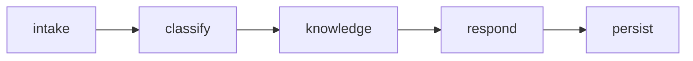

# Customer Support Assistant

Independent customer-support triage application powered by `orbit-core`. Its
native workflow validates a ticket, classifies it, retrieves versioned support
knowledge, composes a recommended response, and persists the result behind an
application-owned repository boundary.



Production composition uses the application-owned PostgreSQL repository.
Deterministic tests inject an in-memory or SQLite-backed repository. Live LLM
response composition is configuration-controlled: classification, approved
knowledge retrieval, citations, and persistence stay deterministic while only
the customer-facing response text is generated by the model. Langfuse and
Admin telemetry use Orbit Core's existing observability contracts.

## Local verification

Copy `.env.example` to `.env` for live execution. Set
`LIVE_LLM_ENABLED=true`, configure the OpenRouter model and credentials, and
configure the Langfuse public key, secret key, and host. Never commit `.env` or
credentials. Leave `LIVE_LLM_ENABLED=false` for deterministic execution.

## Install with private GitHub source

For local development, install the pinned core release and then this repo:

```powershell
python -m pip install `
  "orbit-core @ git+https://github.com/nagaraju-ssa/orbit-repo.git@v0.1.0"
python -m pip install -e ".[test]"
```

Git authentication must come from the developer's credential manager or an
approved environment variable. Do not place a token in `pyproject.toml`, a
requirements file, or a committed URL.

## Install with Azure Artifacts

Authenticate with the team's approved Azure Artifacts credential provider,
then supply the feed as an extra index:

```powershell
$env:PIP_EXTRA_INDEX_URL = "https://pkgs.dev.azure.com/ORG/PROJECT/_packaging/FEED/pypi/simple/"
python -m pip install -e ".[test]"
```

The declared `orbit-core==0.1.0` dependency is then resolved from the private
feed. Replace the placeholder feed URL with the organization-approved value.

## Run and test the workflow

```powershell
python -m pytest
python -m customer_support_assistant.cli --task "Unable to access monthly statement"
uvicorn customer_support_assistant.api:create_app --factory --reload
```

### Local demo endpoints

- Swagger UI: `http://127.0.0.1:8030/docs`
- Readiness: `http://127.0.0.1:8030/health/ready`
- Admin Dashboard: `http://127.0.0.1:8010/admin/`
- Workflow: `POST /support/triage`
- Stored case: `GET /cases/{case_id}`

The Admin Dashboard catalog links back to this README and the source
repository. It receives sanitized workflow telemetry; ticket content,
knowledge payloads, and recommended responses remain owned by this use case.

The approved deterministic API contract is:

- `GET /health/`
- `GET /health/ready`
- `POST /support/triage`
- `GET /cases/{case_id}`
- `GET /openapi.json`

Example request:

```json
{
  "ticket_id": "DEMO-1001",
  "subject": "Unable to access monthly statement",
  "message": "My July statement does not appear after I sign in.",
  "customer_tier": "gold",
  "user_id": "demo-presenter",
  "conversation_id": "demo-support-1001"
}
```

The response contains the case ID, classification, priority, approved knowledge
citations, recommended response, workflow/request identifiers, and creation
time. It does not expose prompts or internal tool payloads.

When live mode is enabled, one LLM call composes `recommended_response` from
the already classified ticket and approved knowledge result. Orbit Core
captures provider-reported token usage and cost when available and correlates
the Langfuse trace with the Admin workflow run.

## Build the demo image

Build Orbit Core first as `orbit-core:demo-205aab8`, then build this
application layer:

```powershell
docker build `
  --build-arg ORBIT_CORE_IMAGE=orbit-core:demo-205aab8 `
  --tag customer-support-assistant:demo-0.1.0 `
  .
```

The image runs as the non-root `orbit` user. `.env`, local virtual
environments, tests, logs, and Git metadata are excluded from the build
context. Inject `DATABASE_URL` only when the container starts.

Admin registration, heartbeat, and sanitized workflow telemetry are optional
and fail open. Enable them at deployment time with the
`ORBIT_ADMIN_CLIENT_*` settings documented in `.env.example`; do not bake
Admin URLs or credentials into the image.

```json
{"task": "Review customer C-100"}
```

After initialization, use the renamed package in the CLI and Uvicorn commands.

## CI configuration

The workflow defaults to the private GitHub source. Add this repository secret:

- `ORBIT_CORE_GITHUB_TOKEN`: read-only fine-grained token for the private
  `nagaraju-ssa/orbit-repo` repository.

Optional repository variables and secrets:

- `ORBIT_CORE_REF`: approved immutable core tag or commit; the workflow
  defaults to the verified local-demo stability commit
  `ab6504b389240aa95b7de1d691a081cd06e9d2f4`.
- `ORBIT_CORE_SOURCE=azure`: resolve the core package from Azure Artifacts.
- `ORBIT_PYPI_INDEX_URL`: authenticated Azure Artifacts Python index URL.

## What teams replace

- `tools.py`: injected clients for approved external systems;
- `agents.py`: one focused capability per agent;
- `workflow.yaml`: orchestration and execution adapter;
- `config.py` and `.env.example`: typed non-secret configuration names;
- tests: deterministic unit, workflow, API, and integration coverage.

Keep business models and calculations outside agents where possible. Add live
systems one boundary at a time, and preserve the public Orbit Core contracts.

The complete training path, checklist, architecture guidance, security rules,
and production-readiness criteria are maintained in the Orbit Core repository
under `docs/usecase-development/`.
